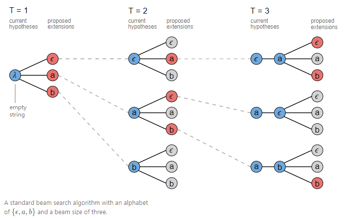
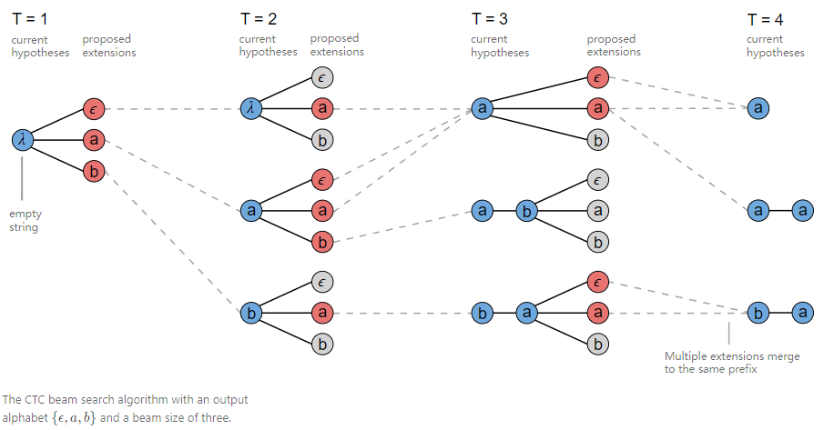
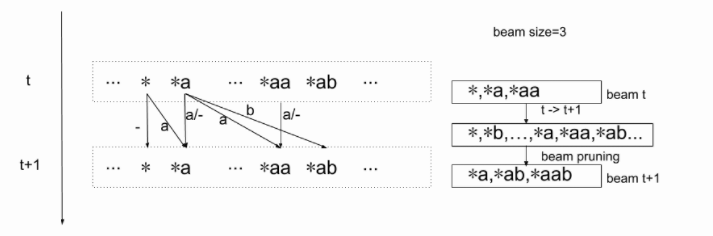

## CTC解码

给定输入序列$X$，CTC的解码目标是找到概率最大的输出序列$Y^*$，即：
$$
Y^*={\underset {Y} {\operatorname {arg\,max} } }\, P(Y\mid X)
$$
在学习CTC损失函数时我们了解到，为了解决时序上语音特征帧与文本标注直接的对齐问题，在建模时引入了blank"-"。那么在解码时通过上式得到的$Y^*$是包括空白符和重复字符的字符串，且在$X$长度为$T$的情况下，求解最大概率字符串的时间复杂度为$N^T$，如此大计算量的方法显然行不通，那么在解码时如何处理才能得到最终我们想要的结果呢？

基于CTC的独立性假设（假设时间步独立），在每个时刻单纯的取最大概率的字符作为输出，这种计算最大概率路径的搜索方式一般被称为greedy search（贪心搜索），但是，这种计算方法并没有考虑存在多个输出序列对应一个真是输出的情况，例如序列$[a,a,-]$与$[a,a,a]$的单独概率都小于$[a,a,b]$，但是他们的真实输出都为$a$，它们的概率之和也会高于后者。

在这里我们定义两个概念：

- CTC字符串：模型在每帧时间点输出的字符组成的字符串。（相同字符及blank没有合并，例如上面举例的$[a,a,-]$）

- 规整字符串：由CTC字符串去除连续重复字符和blank符号后的字符串，即前面提到的真实输出。（如：由上面字符串得到的$a$）

了解到贪心搜索在很多情况下找到的往往不是最优路径，而是接近最优的路径。为此束集搜索（beam search）被应用来解决这个问题，通过设置束集的个数，可以对最优可能路径Y和计算量加以权衡，一般来说大的beam size倾向于获得更好的结果。

常规的beam search在每个时间点T都会计算更新预测，T+1时刻的预测是通过将T时刻预测进行扩展并保留top K个结果作为候选，并通过这些预测后续继续扩展直至输入音频结束。如下图beam size设置为3，在经过T3时刻搜索结束后保留了$[-,a,-],[-,a,b],[a,b,b]$三条CTC字符串路径结果，对CTC字符串进行规整后可以得到$a,ab$两个规整字符串作为备选结果。有了备选结果之后，我们也可以再引入语言模型来做进一步的计算，得到我们想要的输出结果。



## prefix beam search

细心的同学们可能注意到了，常规的beam search算法在扩展时仅仅是保留了概率最高的top K作为后续扩展的候选，这种情况在遇到多条CTC路径规整到相同的输出时会放弃很多路径，这也导致了很多有竞争的路径被舍弃了。例如在T3时刻，current hypotheses： $a$ 可能由路径$[-,a],[a,-],[a,a]$得到，但却因为另外两条路径概率较低仅仅保留了$[-,a]$。prefix beam search是一种对常规束集搜索的改进方法，它在每个时刻都对CTC字符串进行规整并保存，替代了常规的CTC字符串，这种方法可以在搜索的过程中不断的合并相同的前缀，从而保存更多的有用路径。




具体思想：

1. 在每个时刻$t$，计算所有当前可能输出的规整字符串的概率。
2. 因为$t$时刻的字符串长度最长为$t$，所有候选的当前所有可能的解码字符串个数是$\sum_0^tC^t$,其中$C$是字符词典的大小。该值随着时间$t$的增大而增大。
3. 用beam search的方法，在每个时刻选取最好的$N$个路径，从而将每个时间点$t$上的搜索空间变为常数。

下图中的$*$表示一个规整字符串，假设t时刻存在$ *， *a， *aa$等情况，那么箭头表示$t+1$时刻的字符串可能会由哪些t时刻的字符串生成。比如$t+1$时刻 $*ab$来自于两种情况：

- $t$时刻输出规整字符串$*a$, $t+1$时刻输出字符$b$
- $t$时刻输出规整字符串$*ab，t+1$时刻输出字符$b$



对$t$时刻beam内的每一个规整字符串得到概率，更新其对应的$t+1$是个规整字符串的概率值。

但这里不能直接使用规整字符串的概率进行计算。

下面具体例子说明：

假设$t=3$时刻输出规整字符串$a$，$t=4$时刻输出字符$a$，那么该规整字符串$a$的概率为$-a-,-aa,aa-,a--,aaa$等不同CTC字符串的概率的和。

- 如果是在$aa-$这个CTC字符串基础上，在$t+1$时刻在输出字符$b$，得到的CTC字符串为$aa-a$，其规整字符串为$aa$
- 如果是在$aaa$这个CTC字符串基础上，在$t+1$时刻在输出字符$a$，得到的CTC字符串为$aaaa$，其规整字符串为$a$

可以看到两者t+1时刻的输出同为字符啊，却产生了不同的规整字符串。因此，需要区别计算blank和非blank结尾的CTC字符的规整概率：

- $P_b(L)$表示所有以blank结尾且规整后的是$L$的各CTC字符串的**概率之和**
- $P_{nb}(L)$​表示所有以非blank结尾且规整后是$L$的各CTC字符串的**概率之和**

比如，假设T=3，则
$$
P_b = P(aa-) + P(-a-) + P(a--)\\
P_{nb}=P(aaa) + P(-aa) + P(--a)
$$


假设t时刻的规整字符串为$*a$，其$t+1$时刻可以产生的规整字符串由四种情况：

- 当$t+1$时刻输出是blank时，产生规整字符串$*a$
- 当$t+1$时刻输出是$a$时，可以产生规整字符串$*a$
- 当$t+1$时刻输出是a时，也可以产生规整字符串$*aa$
- 当$t+1$时刻输出是其他不为blank的字符b时，产生规整字符串$*ab$

四种情况的对应跟新的通缉令公式如下：
$$
P_b^{t+1}(*a) <=[P_b^t(*a)+P_{nb}^t(*a)]P_{ctc}^{t+1}(-)
\\P_{nb}^{t+1}(*a)<=P_{nb}^t(*a)P_{ctc}^{t+1}(a)
\\P_{nb}^{t+1}(*aa)<=P_b^t(*a)P_{ctc}^t(a)
\\P_{nb}^{t+1}(*ab)<=[P_b^t(*a)+P_{nb}^t(*a)]P_{ctc}^{t+1}(b)
$$

- 公式中<=不是赋值，是+=操作
- 注意，$t$时刻的$*ab$如果处在$t$时刻的beam中，也会用于更新$t+1$时刻 $*ab$的值。但是这个更新是发生在对$t$时刻的$ *ab$计算时。


```c++
struct PrefixScore {
    float s = -kFloatMax;              // blank结尾概率之和
    float ns = -kFloatMax;             // 非blank结尾概率之和
    float v_s = -kFloatMax;            // 维特比blank结尾得分
    float v_ns = -KFloatMax;           // 维特比非blank结尾得分
    float cur_token_prob;              // 当前token概率
    std::vector<int> time_s;           // 维特比blank路径时间
    std::vector<int> time_ns;          // 维特比非blank路径时间
    
    PrefixScore() = default;
    float score() const { return LogAdd(s,ns); }  
    float viterbi_score() const { return v_s > v_ns ? v_s : v_ns; }
    const std::vector<int>& times() const {
        return v_s > s_ns ? times_s : times_ns;
    }
}


void Search(const torch::Tensor& logp) {
    CHECK_EQ(logp.dtype(), torch::kFloat);
    CHECK_EQ(logp.dim(),2);
    for(int t = 0; t < logp.size(0); ++t, ++abs_time_step_) {
        torch::Tensor logp_t = logp[t];
        std::unordered_map<std::vector<int>, PrefixScore, PrefixHash> next_hyps;
        // 1.对beam进行排序后剪枝，只保留topk个候选token
        std::tuple<Tensor, Tensor> topk = logp_t.topk(opts_.first_beam_size);
        Tensor topk_score = std::get<0>(topk);
        Tensor topk_index = std::get<1>(topk);
        
        // 2. Token Passing
        for(int i = 0; i < topk_index.size(0); ++i) {
            int id = topk_index[i].item<int>();
            auto prob = topk_score[i].item<float>();
            for (const auto& it : cur_hyps_) {
                const std::vector<int>& prefix = it.first;    // prefix用于存放截至到t时刻的规整字符串路径
                const PrefixScore& prefix_score = it.second;  // prefix_score 用于存放当前路径分数
                // 如果next_hyps中查找不到prefix, next_hyps[prefix]将默认置为PrefixScore(-inf,-inf)
                // 因为PrefixScore默认构造函数分别设置s及ns为-inf。
                // 针对t时刻*a，t+1时刻的四种情况：
                if (id == opts_.blank) {
                    // (1). t+1时刻输出为blank,产生规整字符串*a
                    // Case 1: *a + ε => *a
                    PrefixScore& next_score = next_hyps[prefix];  // case1产生blank，规整字符串与t时刻相同，prefix不变
                    next_score.s = LogAdd(next_score.s, prefix_socre.score() + prob);  // 类似于map[key]++ ??
                    next_score.v_s = prefix_score.viterbi_score() + prob;
                    next_score.time_s = prefix_score.times();
                }
                else if (!prefix.empty() && id == prefix.back()) {
                    // (2). t+1时刻输出字符与t时刻字符相同，产生规整字符串*a
                    // Case 2: *a + a => *a
                    PrefixScore& next_score1 = next_hyps[prefix]; // case2产生相同的字符，规整字符串与t时刻相同，prefix不变
                    next_score1.ns = LogAdd(next_score1.ns, prefix_score.ns + prob);
                    if (next_score1.v_ns < prefix_score.v_ns + prob) { //如果viterbi得分小？？更新
                        next_score1.v_ns = prefix_score.v_ns + prob;
                        if (next_score1.cur_token_prob < prob) {
                            next_score1.cur_token_prob = prob;
                            next_score1.times_ns = prefix_score.time_ns;
                            CHECK_GT(next_score1.times_ns.size(), 0);
                            next_score1.times_ns.back() = abs_time_step_;
                        }
                    }
                    // (3). t时刻为blank，t+1为a，产生规整字符串*aa
                    // Case 3: *aε + a => *aa       
                    std::vector<int> new_prefix(prefix);
                    new_prefix.emplace_back(id);                 //case3 产生相同的字符，t时刻为blank，更新prefix
                    PrefixScore& next_score2 = next_hyps[new_prefix];
                    next_score2.ns = LogAdd(next_score2.ns, prefix_score.s + prob);
                    if (next_score2.v_ns < prefix_score.v_s + prob) {
                        next_score2.v_ns = prefix_score.v_s + prob;
                        next_score2.cur_token_prob = prob;
                        next_score2.times_ns = prefix_score.times_s;
                        next_score2.times_ns.emplace_back(abs_time_step_);
                    }
                } // end elseif
                else {
                    // (4). 当t+1输出是b时(或其他不等于a和blank的字符)，产生规整字符串*ab
                    std::vector<int> new_prefix(prefix);
                    new_prefix.emplace_back(id);
                    next_score.ns = LogAdd(next_score.ns, prefix_score.score() = prob);
                    if (next_score.v_ns < prefix_score.viterbi_score() + prob) {
                        next_score.v_ns = prefix_score.viterbi_score() + prob;
                        next_score.cur_token_prob = prob;
                        next_score.times_ns = prefix_score.times();
                        next_score.times_ns.emplace_back(abs_time_step_);
                    }
                }
            } // 当前所有可能字符串
        } // topk个token
        // 3. 第二遍剪枝，仅仅保留top n路径
        std::vetor<std::pair<std::vector<int>, PrefixScore>> arr(next_hyps.begin(), next_hyps.end());
        int second_beam_size = std::min(static_cast<int>(arr.size()), opts_.second_beam_size);
        std::nth_element(arr.begin(), arr.begin() + second_beam_size, arr.end(), PrefixScoreCompare);
        arr.resize(second_beam_size);
        std::sort(arr.begin(), arr.end(), PrefixScoreCompare);
        // 4. 更新 cur_hpys并且得到新的结果
        cur_hpys_.clear();
        hypotheses_.clear();
        likelihood_.clear();
        viterbi_likelihood_.clear();
        times_.clear();
        for (auto& item : arr) {
            cur_hyps_[item.first] = item.second;
            hypotheses_.emplace_back(std::move(item.first));
            likelihood_.emplace_back(item.second.score());
            viterbi_likelihood_emplace(item.second.viterbi_score());
            times_.emplace_back(item.second.times());
        }   
    } // t => t+1
}
```


参考资料：

1. https://distill.pub/2017/ctc/
2. http://placebokkk.github.io/asr/2020/02/01/asr-ctc-decoder.html
3. [wenet](https://github.com/wenet-e2e/wenet)

