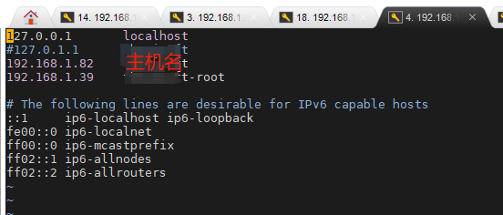
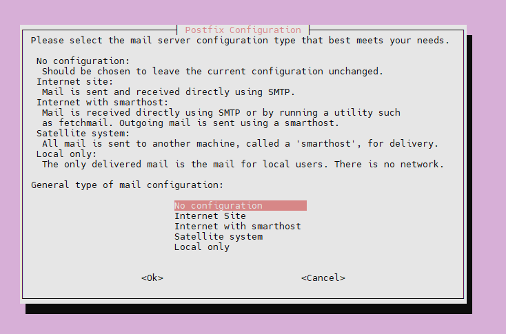
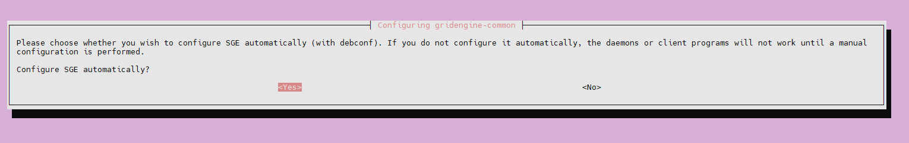
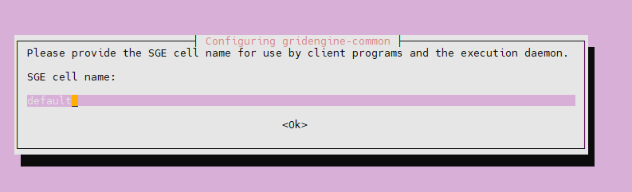
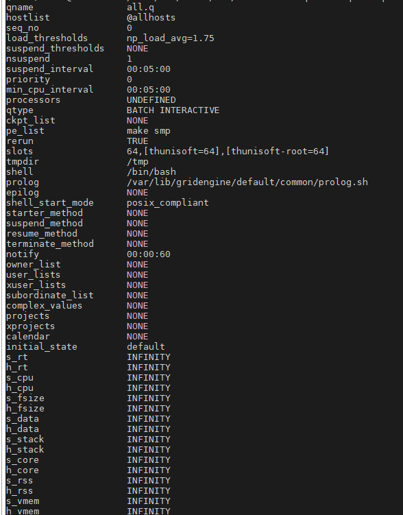

## Background：

本文以局域网内两台服务器192.168.1.82与192.168.1.39为例，简述kaidi多机多卡环境搭建。我们以82服务器作为SGE master以及node1 worker，39服务器作为node2 worker。

## Step1. NFS安装配置：

在82安装nfs server并修改etc/exports使相关目录可以挂载到nfs client端

```shell
sudo apt-get install nfs-kernel-server
vim /etc/exprots
### 编辑添加kaldi路径
/home/dev/kaldi 192.168.1.39(rw,sync,no_root_squash,no_subtree_check)
```

在39安装nfs client并将82端kaldi路径挂载到39相同目录下

```shell
sudo apt-get install nfs-common
cd /home/dev
mkdir kaldi
sudo mount 172.16.122.115:/home/dev/kaldi /home/dev/kaldi

### 挂载路径错误使可解除挂载
umount: sudo umount -f -l /home/dev/kaldi
```

## Step2. SGE安装：

在82安装SGE并作为master

```shell
### 安装前查看主机名称与ip后面使用
hostname
xxx
hostname -I
192.168.1.82
```

编辑修改etc/hosts，添加client端

```
vim /etc/hosts
```



因为这里我们将82既做主机又作为worker node1所以同时安装master与client

```shell
#会出现设置邮箱地址，节点名称等皆可默认设置，主机名称需要与hostname相同
sudo apt-get install gridengine-master gridengine-client
#保存并重启服务
sudo service gridengine-master restar

##########################################################################################################################
#修复gridengine-client 有需要时使用
#已知存在一个错误，该错误的原因在于gridengine-client文件中存在一个文件，该文件阻止安装gridengine-master。为避免这种情况，请执行以下操作：
cd Downloads
wget http://ftp.debian.org/debian/pool/main/g/gridengine/gridengine-client_8.1.9+dfsg-9_amd64.deb 
mkdir gec
dpkg -X gridengine-client_8.1.9+dfsg-9_amd64.deb gec 
cd gec/usr/lib/gridengine
sudo cp libspoolb.so libspoolc.so spooldefaults.bin /usr/lib/gridengine

#为libjemalloc.so.2创建一个符号链接
cd /usr/lib/x86_64-linux-gnu
sudo ln -s libjemalloc.so.1 libjemalloc.so.2
#修复完成后使用以下命令安装gridengine-master，gridengine-qmon，gridengine-exec
sudo apt install gridengine-master gridengine-qmon gridengine-exec
```

在39安装client

```shell
#会出现设置邮箱地址，节点名称等皆可默认设置，主机名称需要与hostname相同
sudo apt-get install gridengine-client gridengine-exec

#修复gridengine-client
#已知存在一个错误，该错误的原因在于gridengine-client文件中存在一个文件，该文件阻止安装gridengine-master。为避免这种情况，请执行以下操作：
cd Downloads
wget http://ftp.debian.org/debian/pool/main/g/gridengine/gridengine-client_8.1.9+dfsg-9_amd64.deb 
mkdir gec
dpkg -X gridengine-client_8.1.9+dfsg-9_amd64.deb gec 
cd gec/usr/lib/gridengine
sudo cp libspoolb.so libspoolc.so spooldefaults.bin /usr/lib/gridengine

#为libjemalloc.so.2创建一个符号链接
cd /usr/lib/x86_64-linux-gnu
sudo ln -s libjemalloc.so.1 libjemalloc.so.2
#修复完成后使用以下命令安装gridengine-master，gridengine-qmon，gridengine-exec
sudo apt-get install gridengine-qmon gridengine-exec
```

下面附安装时的一些选项图：

邮件不做设置





cell name保持默认



host name 与本机hostname一致


(PS:第一次装可能会输入错误，若错误不知道咋改 则可卸载按上述流程重装。。。)

```shell
 apt-get --purge remove -y gridengine-client
 apt-get --purge remove -y gridengine-master
 apt-get --purge remove -y gridengine-common
 apt-get --purge remove -y gridengine-exec
 rm -rf `locate gridengine`
```

修改客户机ip

```shell
vim /etc/hosts
#添加并 删除原有
192.168.1.82    your_hostname
```

到这里SGE环境安装就结束了，下面我们看一下如何配置。

## Step3. SGE安装：

首先添加master节点到管理列表

```shell
qconf -am hostname(master节点)
```

定义队列all.q

```shell
qconf -aq
```



complex values中添加ram及gpu相关属性

```shell
qconf -mc

#name               shortcut    type        relop requestable consumable default  urgency
#------------------------------------------------------------------------------------------
<snip>
mem_free            mf         MEMORY      <=    YES         YES         1G        0

#name               shortcut    type        relop requestable consumable default  urgency
#------------------------------------------------------------------------------------------
<snip>
gpu                 g           INT         <=    YES         YES        0        10000
ram_free            ram_free    MEMORY      <=    YES         JOB        1G       0
```

添加管理host及两个submit host 两个执行host

```shell
qconf -ah hostname  ##(master)
qconf -as hostname  ##(master)
qconf -as hostname  ##(client)

qconf -ae
hostname master_hostname
complex_values ram_free=160G,gpu=4
qconf -ae
hostname client_hostname
complex_values ram_free=160G,gpu=4
```

添加smp并行环境，并在all.q中修改pe_list

```shell
 qconf -ap smp
 pe_name            smp
 slots              9999
 qconf -mq all.q
 pe_list            make smp
```

修改all.q prolog

```shell
 qconf -mq all.q
 prolog                /var/lib/gridengine/default/common/prolog.sh
```

在指定目录下创建prolog.sh并chmod 777为可执行文件（client机也需要添加）

```shell
vim /var/lib/gridengine/default/common/prolog.sh
chmod 777 /var/lib/gridengine/default/common/prolog.sh
```

```shell
###prolog.sh
###!/bin/bash
function test_ok {
  if [ ! -z "$JOB_SCRIPT" ] && [ "$JOB_SCRIPT" != QLOGIN ] && [ "$JOB_SCRIPT" != QRLOGIN ]; then
    if [ ! -f "$JOB_SCRIPT" ]; then
       echo "$0: warning: no such file $JOB_SCRIPT, will wait" 1>&2
       return 1;
    fi
  fi
  if [ ! -z "$SGE_STDERR_PATH" ]; then
    if [ ! -d "`dirname $SGE_STDERR_PATH`" ]; then
      echo "$0: warning: no such directory $JOB_SCRIPT, will wait." 1>&2
      return 1;
    fi
  fi
  return 0;
}

if ! test_ok; then
  sleep 2;
  if ! test_ok; then
     sleep 4;
     if ! test_ok; then
        sleep 8;
     fi
  fi
fi

exit 0;
```

添加各个执行节点到host group （@allhosts）

```shell
qconf -ahgrp @allhosts
group_name @allhosts
hostlist master_hostname client_hostname
```

修改all.q中hostlist

```shell
hostlist     @allhosts
```

修改all.q中rerun属性为TRUE,之后出现断线出现Eqw时可重新提交任务

## 任务相关指令：

` qhost -q`  指令可以查看all.q中各个host的配置情况

```text
qhost -q

HOSTNAME                ARCH         NCPU NSOC NCOR NTHR  LOAD  MEMTOT  MEMUSE  SWAPTO  SWAPUS
----------------------------------------------------------------------------------------------
global                   -            -    -    -    -     -       -       -       -       -
host1               lx-amd64          64   2    32  64   10.40   251.8G   30.7G   61.0G    0.0
   all.q            BIP   0/4/64
host2               lx-amd64          64   2    32  64    9.40   251.8G    8.9G   95.4G    0.0
   all.q            BIP   0/6/64
```

` qstat -f ` 指令可查看执行host状态，若state栏存在` E` 或` au` 等其他状态, 则表示存在错误可用指令` qmod` 尝试去除后尝试运行

```text
queuename                      qtype resv/used/tot. load_avg arch          states
---------------------------------------------------------------------------------
all.q@host1                     BIP   0/4/64         10.92    lx-amd64        E
---------------------------------------------------------------------------------
all.q@host2                     BIP   0/6/64         9.81     lx-amd64        E


qmod -d all.q
qmod -d all.q@host1
qmod -d all.q@host2

qmod -d all.q@host1 用来关闭节点 states 显示 d
qmod -e all.q@host1 用来打开节点 states 无标记
```

线程运行时，可以产所有线程状态，利用jobid可以查看具体错误的信息

`qstat -u '*'` 
` qstat -j jobid` 

删除终止任务

` qdel job-ID`  删除job，如删除上述任务：` qdel 22` 

` qdel -u usrname`  删除用户的所有任务

挂起任务

 使用命令 `qalter -h u jobid` 将job暂停， 

并使用命令`qalter -h U jobid`在适合的时间重新启动 

| Category  | State                                          | SEG Letter Code                        |
| --------- | ---------------------------------------------- | -------------------------------------- |
| Pending   | pending/ pending, user hold                    | qw                                     |
| Pending   | pending, user and system hold                  | hqw                                    |
| Pending   | pending, user and system hold, re-queue        | hRwq                                   |
| Running   | running                                        | r                                      |
| Running   | transferring                                   | t                                      |
| Running   | running, re-submit                             | Rr                                     |
| Running   | transferring, re-submit                        | Rt                                     |
| Suspended | obsuspended                                    | s, ts                                  |
| Suspended | queue suspended                                | S, tS                                  |
| Suspended | queue suspended by alarm                       | T, tT                                  |
| Suspended | allsuspended withre-submit                     | Rs,Rts,RS, RtS, RT, RtT                |
| Error     | allpending states with error                   | Eqw, Ehqw, EhRqw                       |
| Deleted   | all running and suspended states with deletion | dr,dt,dRr,dRt,ds, dS, dT,dRs, dRS, dRT |

## 常见错误Common Error：

```shell
#1 @allhosts配置不正确
commlib error: can't resolve host name (can't resolve rdata hostname "host1")
#2 配置问题
can't get password entry for user "host1". Either user does not exist or error with NIS/LDAP etc
#3 修改mconf qconf -mconf min user id
job rejected: your user id 0 is lower than minimum user id 1000 of cluster configuration
#4 找不到目录，发现挂载消失需重新挂载
error: can't chdir to /home/user/egs/aishell/s5: No such file or directory
#5 权限问题chmod 777或者 vim /etc/exprots修改配置？
error: can't open output file ".../make_mfcc/train/q/make_mfcc_pitch_train.log": Permission denied
#6 qstat -u '*' 状态总为 qw

#7 /var/lib/gridengine/default/common/act_qmaster 中的master改为host
error: commlib error: got select error (Connection refused)
error: unable to send message to qmaster using port 6444 on host "host2": got send error
```

## Qconf指令：

```shell
usage: qconf [options]
   [-aattr obj_nm attr_nm val obj_id_list]  add to a list attribute of an object
   [-Aattr obj_nm fname obj_id_list]        add to a list attribute of an object
   [-acal calendar_name]                    add a new calendar
   [-Acal fname]                            add a new calendar from file
   [-Ackpt fname]                           add a checkpointing interface definition from file
   [-aconf host_list]                       add configurations
   [-Aconf file_list]                       add configurations from file_list
   [-ae [exec_server_template]]             add an exec host using a template
   [-Ae fname]                              add an exec host from file
   [-ah hostname_list]                      add an administrative host
   [-ahgrp group]                           add new host group entry
   [-Ahgrp file]                            add new host group entry from file
   [-arqs [rqs_list]]                       add resource quota set(s)
   [-Arqs fname]                            add resource quota set(s) from file
   [-am user_list]                          add user to manager list
   [-ao user_list]                          add user to operator list
   [-ap pe-name]                            add a new parallel environment
   [-aprj]                                  add project
   [-Aprj fname]                            add project from file
   [-aq [queue_name]]                       add a new cluster queue
   [-Aq fname]                              add a queue from file
   [-ar ar_id]                              bind job to advance reservation
   [-as hostname_list]                      add a submit host
   [-astree]                                create/modify the sharetree
   [-Astree fname]                          create/modify the sharetree from file
   [-au user_list listname_list]            add user(s) to userset list(s)
   [-Au fname]                              add userset from file
   [-auser]                                 add user
   [-Auser fname]                           add user from file
   [-ckpt ckpt-name]                        request checkpoint method
   [-clear]                                 skip previous definitions for job
   [-clearusage [user_list]]                clear sharetree usage for user_list or all users/projects
   [-cq wc_queue_list]                      clean queue
   [-dattr obj_nm attr_nm val obj_id_list]  delete from a list attribute of an object
   [-Dattr obj_nm fname obj_id_list]        delete from a list attribute of an object
   [-dcal calendar_name]                    delete calendar
   [-dckpt ckpt_name]                       delete checkpointing interface definition
   [-dconf host_list]                       delete local configurations
   [-de host_list]                          delete exec host
   [-display display]                       set DISPLAY variable inside interactive job (not available for qrsh without command)
   [-dh host_list]                          delete administrative host
   [-dhgrp group]                           delete host group entry
   [-dl date_time]                          request a deadline initiation time
   [-drqs rqs_list]                         delete resource quota set(s)
   [-dm user_list]                          delete user from manager list
   [-do user_list]                          delete user from operator list
   [-dp pe-name]                            delete parallel environment
   [-dprj project_list]                     delete project
   [-dq wc_queue_list]                      delete queue
   [-ds host_list]                          delete submit host
   [-dstnode node_list]                     delete sharetree node(s)
   [-dstree]                                delete the sharetree
   [-du user_list listname_list]            delete user(s) from userset list(s)
   [-duser user_list]                       delete user(s)
   [-help]                                  print this help
   [-ke[j] host_list                        shutdown execution daemon(s)
   [-k{m|s}]                                shutdown master|scheduling thread
   [-kec evid_list]                         kill event client
   [-kt thread_name]                        kill qmaster thread
   [-Mattr obj_nm fname obj_id_list]        modify an attribute (or element in a sublist) of an object
   [-mc ]                                   modify complex attributes
   [-Mc fname]                              modify complex attributes from file
   [-mcal calendar_name]                    modify calendar
   [-Mcal fname]                            modify calendar from file
   [-mckpt ckpt_name]                       modify a checkpointing interface definition
   [-Mckpt fname]                           modify a checkpointing interface definition from file
   [-mconf [host_list|global]]              modify configurations
   [-Mconf file_list]                       modify configurations from file_list
   [-me server]                             modify exec server
   [-Me fname]                              modify exec server from file
   [-mhgrp group]                           modify host group entry
   [-Mhgrp file]                            modify host group entry from file
   [-mrqs [rqs_list]]                       modify resource quota set(s)
   [-Mrqs fname [rqs_list]]                 modify resource quota set(s) from file
   [-mp pe-name]                            modify a parallel environment
   [-Mp fname]                              modify a parallel environment from file
   [-mprj project]                          modify a project
   [-Mprj fname]                            modify project from file
   [-mq queue]                              modify a queue
   [-Mq fname]                              modify a queue from file
   [-msconf]                                modify scheduler configuration
   [-Msconf fname]                          modify scheduler configuration from file
   [-mstnode node_shares_list]              modify sharetree node(s)
   [-mstree]                                modify/create the sharetree
   [-Mstree fname]                          modify/create the sharetree from file
   [-mu listname_list]                      modify the given userset list
   [-Mu fname]                              modify userset from file
   [-muser user]                            modify a user
   [-Muser fname]                           modify a user from file
   [-purge obj_nm3 attr_nm objectname]      deletes attribute from object_instance
   [-R y[es]|n[o]]                          reservation desired
   [-rattr obj_nm attr_nm val obj_id_list]  replace a list attribute of an object
   [-Rattr obj_nm fname obj_id_list]        replace a list attribute of an object
   [-rsstnode node_list]                    show sharetree node(s) and its children
   [-sc]                                    show complex attributes
   [-scal calendar_name]                    show given calendar
   [-scall]                                 show a list of all calendar names
   [-sckpt ckpt_name]                       show checkpointing interface definition
   [-sckptl]                                show all checkpointing interface definitions
   [-sconf [host_list|global]]              show configurations
   [-sconfl]                                show a list of all local configurations
   [-sds]                                   show detached settings
   [-se server]                             show given exec server
   [-secl]                                  show event client list
   [-sel]                                   show a list of all exec servers
   [-sh]                                    show a list of all administrative hosts
   [-shgrp group]                           show host group
   [-shgrp_tree group]                      show host group and used hostgroups as tree
   [-shgrp_resolved group]                  show host group with resolved hostlist
   [-shgrpl]                                show host group list
   [-sm]                                    show a list of all managers
   [-so]                                    show a list of all operators
   [-sobjl obj_nm2 attr_nm val]             show objects which match the given value
   [-sp pe-name]                            show a parallel environment
   [-spl]                                   show all parallel environments
   [-sprj project]                          show a project
   [-sprjl]                                 show a list of all projects
   [-sq [wc_queue_list]]                    show the given queue
   [-sql]                                   show a list of all queues
   [-srqsl]                                 show resource quota set list
   [-ss]                                    show a list of all submit hosts
   [-ssconf]                                show scheduler configuration
   [-sstnode node_list]                     show sharetree node(s)
   [-sst]                                   show a formatted sharetree
   [-sstree]                                show the sharetree
   [-su listname_list]                      show the given userset list
   [-sul]                                   show a list of all userset lists
   [-suser user_list]                       show user(s)
   [-suserl]                                show a list of all users
   [-tc max_running_tasks]                  throttle the number of concurrent tasks
   [-tsm]                                   trigger scheduler monitoring
   [-verbose]                               verbose information output
   [-w e|w|n|v|p]                           verify mode (error|warning|none|just verify|poke) for jobs
```

